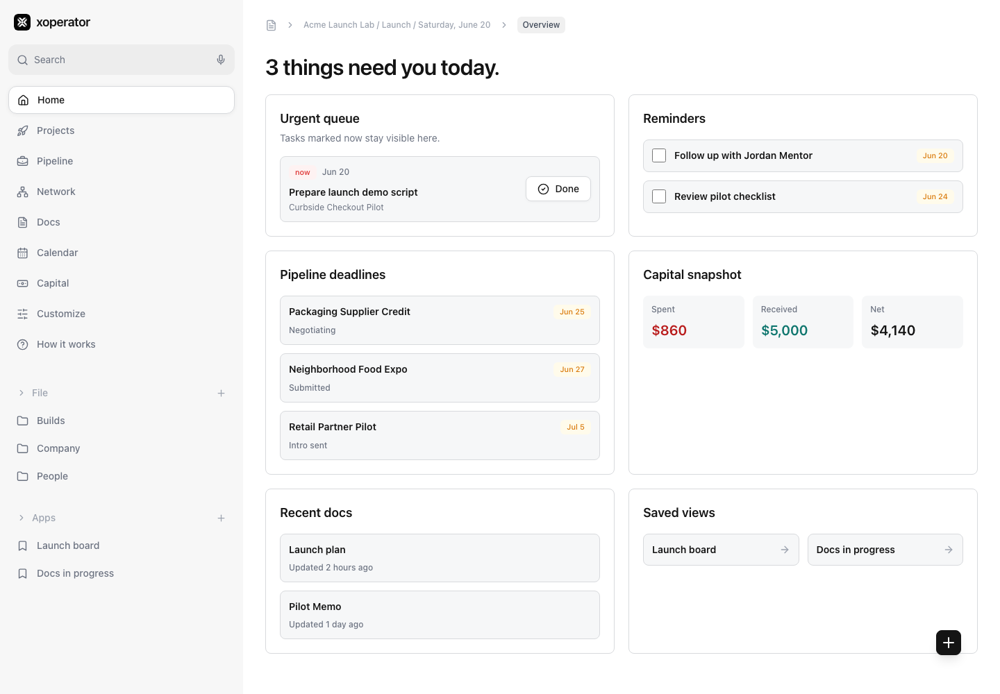
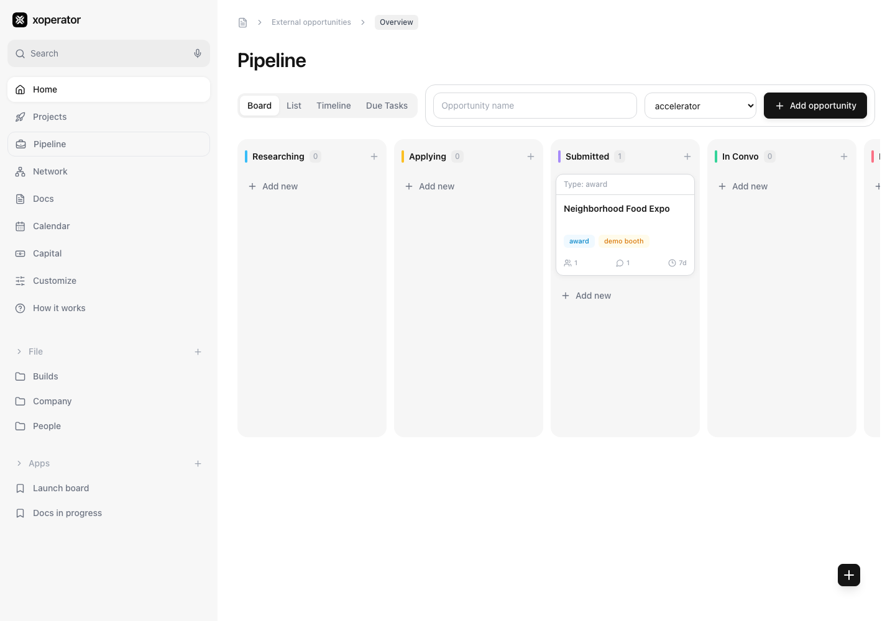
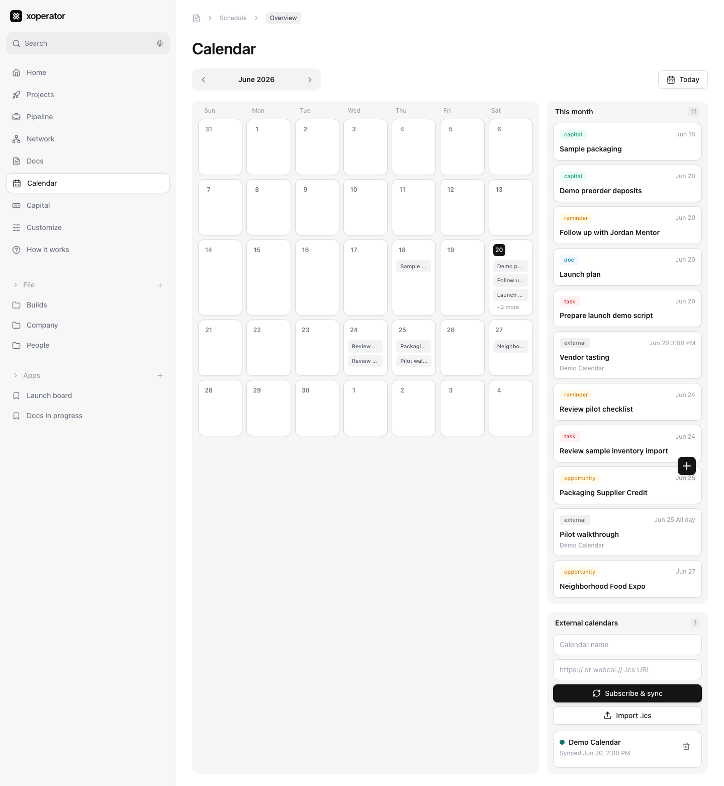
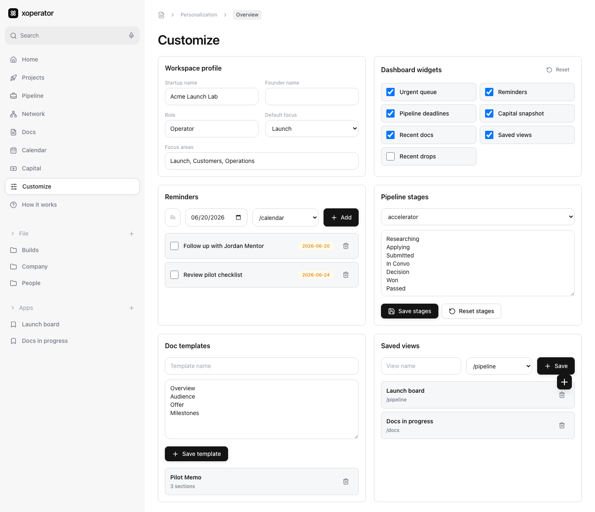
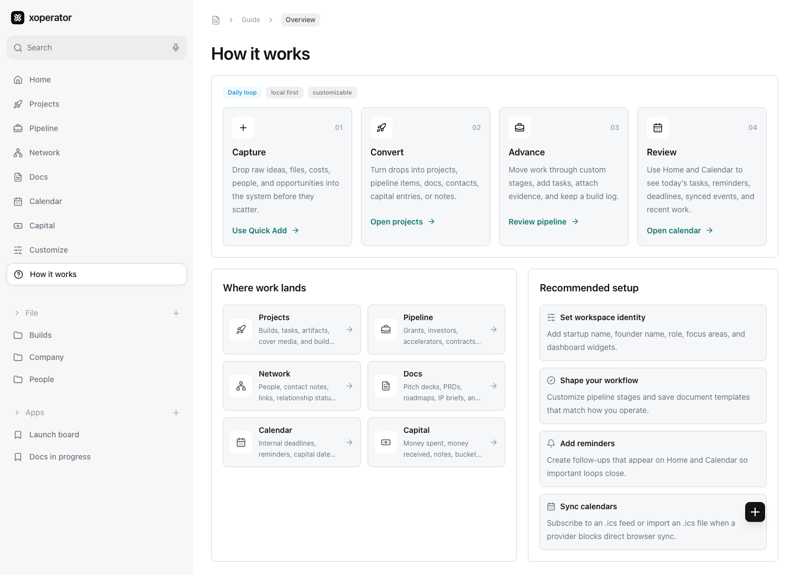

# xoperator

xoperator is a local-first founder operating system for keeping a startup’s work in one place: projects, opportunity pipeline, network, docs, calendar, capital, reminders, attachments, and optional local AI triage.

It is built as a fast React app with persisted local browser storage. No cloud backend is required.



## What It Does

- **Home dashboard**: urgent work, reminders, pipeline deadlines, capital snapshot, recent docs, and saved views.
- **Projects**: build logs, tasks, artifacts, cover media, and status tracking.
- **Pipeline**: external opportunities such as accelerators, grants, investors, jobs, partnerships, awards, and contracts.
- **Network**: people, relationship status, notes, links, and opportunity connections.
- **Docs**: pitch decks, PRDs, roadmaps, IP briefs, one-pagers, and custom templates.
- **Calendar**: internal dates plus external `.ics` feed sync or `.ics` file import.
- **Capital**: money spent, money received, buckets, notes, and net position.
- **Customize**: workspace identity, dashboard widgets, reminders, custom pipeline stages, doc templates, and saved views.
- **Local AI**: optional Ollama-powered quick triage and doc drafting.

## Screenshots

| Pipeline | Calendar |
| --- | --- |
|  |  |

| Customize | How it works |
| --- | --- |
|  |  |

## How It Works

xoperator is organized around a simple founder loop:

1. **Capture** raw work quickly with Quick Add: ideas, costs, people, docs, opportunities, notes, and files.
2. **Convert** each drop into the right workspace: Projects, Pipeline, Network, Docs, Calendar, or Capital.
3. **Advance** the work with tasks, stages, logs, reminders, templates, and attachments.
4. **Review** the dashboard and calendar to decide what needs attention today.

The in-app **How it works** page links directly into each workflow.

## Local-First Data

xoperator stores app data in your browser:

- App state: `localStorage` key `owo-os-state`
- Attachments: IndexedDB database `owo-os-media`

Because it is local-first, clearing browser storage will clear the app data for that browser profile. Export/import is a good future contribution area.

## Tech Stack

- React 18
- TypeScript
- Vite
- Tailwind CSS
- Zustand persistence
- IndexedDB via `idb`
- Playwright end-to-end tests
- Optional Ollama local model integration

## Getting Started

Requirements:

- Node.js 20+
- npm

Install dependencies:

```bash
npm install
```

Run the development server:

```bash
npm run dev
```

Open:

```text
http://localhost:5173
```

Build for production:

```bash
npm run build
```

Run end-to-end tests:

```bash
npm run test:e2e
```

## Optional Local AI

The app includes optional Ollama calls for:

- Quick Add AI sorting
- Drafting doc sections

By default the code points at:

```text
http://localhost:11434
```

and model:

```text
gemma4:12b-mlx
```

If Ollama is not running, the app still works. AI actions show user-facing errors instead of blocking the rest of the workflow.

To adapt the model, edit:

```text
src/services/ollama.ts
```

## External Calendars

Calendar supports two external calendar paths:

- Subscribe to a public/private `.ics` feed URL using `https://` or `webcal://`
- Import an `.ics` file directly

Some providers block browser-based feed syncing with CORS rules. When that happens, import the `.ics` file instead.

## Project Structure

```text
src/
  components/      shared layout, media, and UI primitives
  pages/           app routes and feature screens
  services/        Ollama and ICS parsing/sync helpers
  store/           Zustand state and document definitions
  types/           shared TypeScript types
  utils/           small date/id/class helpers
tests/             Playwright end-to-end tests
docs/screenshots/  README screenshots
```

## Validation

Current checks:

```bash
npm run build
npm run test:e2e
npm audit --audit-level=moderate
```

## Contributing

Contributions are welcome. Good first areas:

- Data export/import
- Authenticated Google/Apple/Outlook calendar integrations
- Drag-and-drop pipeline columns
- Search across all entities
- Theme and density preferences
- More robust attachment management

See [CONTRIBUTING.md](CONTRIBUTING.md).

## License

MIT. See [LICENSE](LICENSE).
